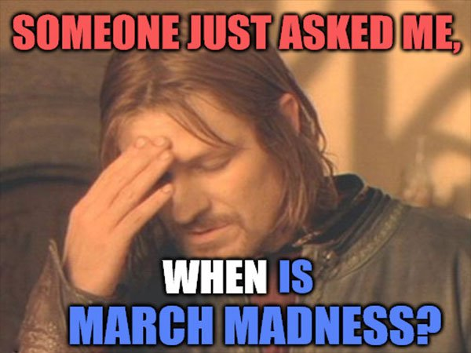
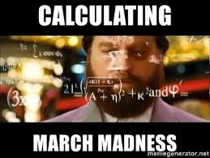
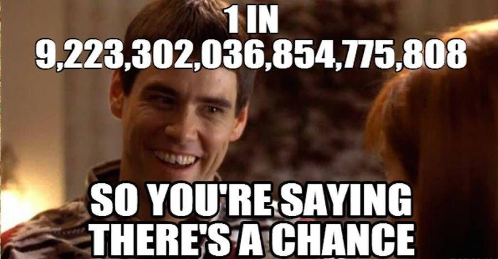
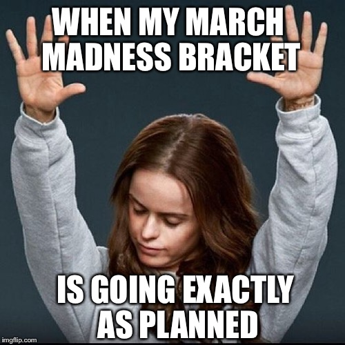
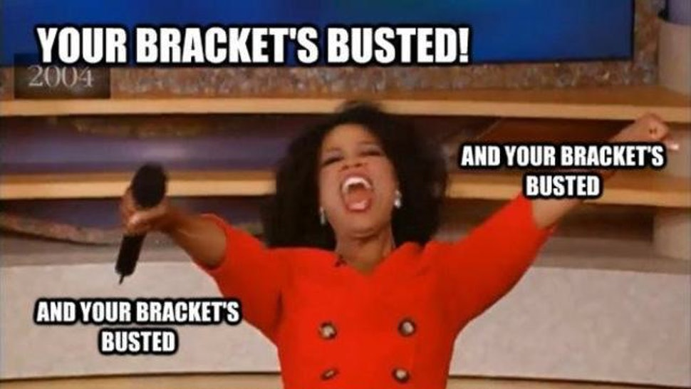
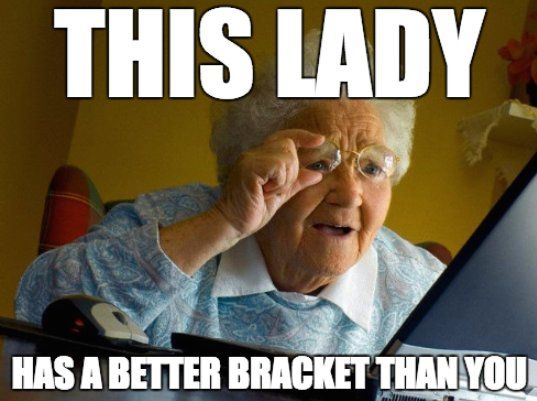
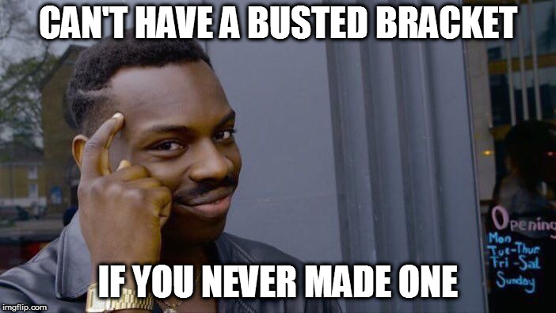

```{r setup, include=FALSE}
knitr::opts_chunk$set(echo = TRUE)
```

## Acknowledgements
First of all, I would just like to thank you all for reading this study. I know it is quite long and detailed, but I hope it was interesting and enlightening. Also, I would like to thank JDRS and all the TAs and ULAs, who were great resources throughout the whole semester. Finally, I would like to thank my friend Arrunava Moondra and my dad Raj Jain for helping me plan and proof read this study.

## Disclaimer
Next, I would like to leave a disclaimer. While this study does aim to predict March Madness bracket results, it does not condone any sort of illegal betting. Furthermore, if you use the results in (legal) betting, I am not responsible for any potential losses or woes. Best of luck!

## Memes
And now\ldots I will finally present the final portion of this study\ldots what you have all been waiting for: \textbf{the memes}, presented as a story about your feelings regarding this analysis.
\bigbreak
```{r before, echo = FALSE, fig.cap = "Your friends critcizing you for not knowing about March Madness before this study", out.width = '100%', fig.align = "center"}

```
\bigbreak
```{r calculating, echo = FALSE, fig.cap = "You filling out your bracket after reading this study", out.width = '100%', fig.align = "center"}

```
\bigbreak
```{r perfect, echo = FALSE, fig.cap = "You thinking you can make a perfect bracket using multivariate analysis", out.width = '100%', fig.align = "center"}

```
\bigbreak
```{r winning, echo = FALSE, fig.cap = "You when your statistics predicted the first game correctly", out.width = '100%', fig.align = "center"}

```
\bigbreak
```{r busted, echo = FALSE, fig.cap = "Your bracket being busted because you relied only on statistics", out.width = '100%', fig.align = "center"}

```
\bigbreak
```{r grranda, echo = FALSE, fig.cap = "Your grandma doing better just choosing the coolest mascots", out.width = '100%', fig.align = "center"}

```
\bigbreak
```{r nobracket, echo = FALSE, fig.cap = "You realizing it's better to not make a bracket at all", out.width = '100%', fig.align = "center"}

```