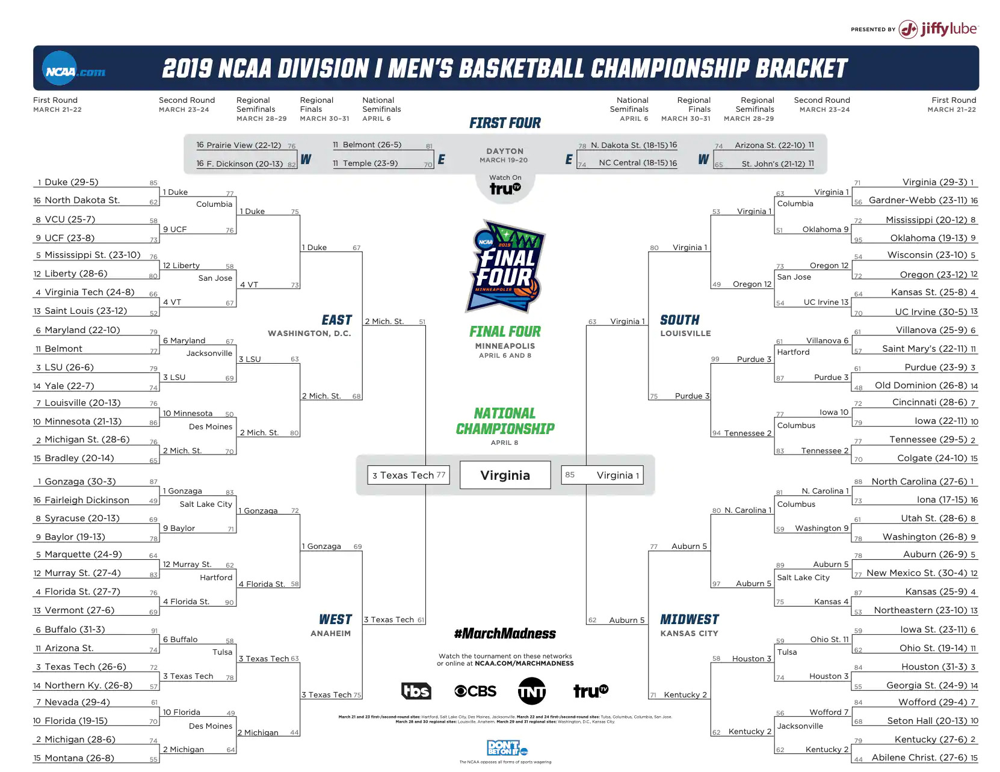

```{r setup, include=FALSE}
knitr::opts_chunk$set(echo = TRUE)
```


\bigbreak
One of the most popular annual sporting events, the NCAA Division I Men's Basketball Tournament---better known by its colloquial nickname March Madness---is also one of the most scrutinized. This single-elimination tournament was created in 1939 by the National Association of Basketball Coaches and has been played every year since. Currently, it features 64 of the nation's best college basketball teams (68 including the play-in games) and hence is comprised of six rounds, known as: the First Round (or Round of 64), the Second Round (or Round of 32), the Sweet Sixteen, the Elite Eight, the Final Four, and the Championship. Furthermore, it is divided into four regions, each of which has teams seeded from 1 to 16, where 1 seeds are most favored and 16 seeds are the biggest underdogs. The tournament teams include champions from 32 Division I conferences, who receive automatic bids, and 36 teams chosen by the NCAA selection committee, who receive at-large bids.

As a predictive exercise with a huge amount of data on each team, it is quite natural to apply multivariate statistics to the NCAAM Basketball Tournament. While notoriously random and unexpected, there are significant patterns across the years, and this study aims to uncover and illustrate some of these trends. Using a variety of statistical methods, it attempts to break down and demystify ideas like favorites, busts, upsets, Cinderella teams, and more, with the ultimate goal of being able to predict tournament success given a team's regular season performance and tournament seed. The results of this study may not be able to predict a perfect bracket, but they will get us one step closer to that goal.